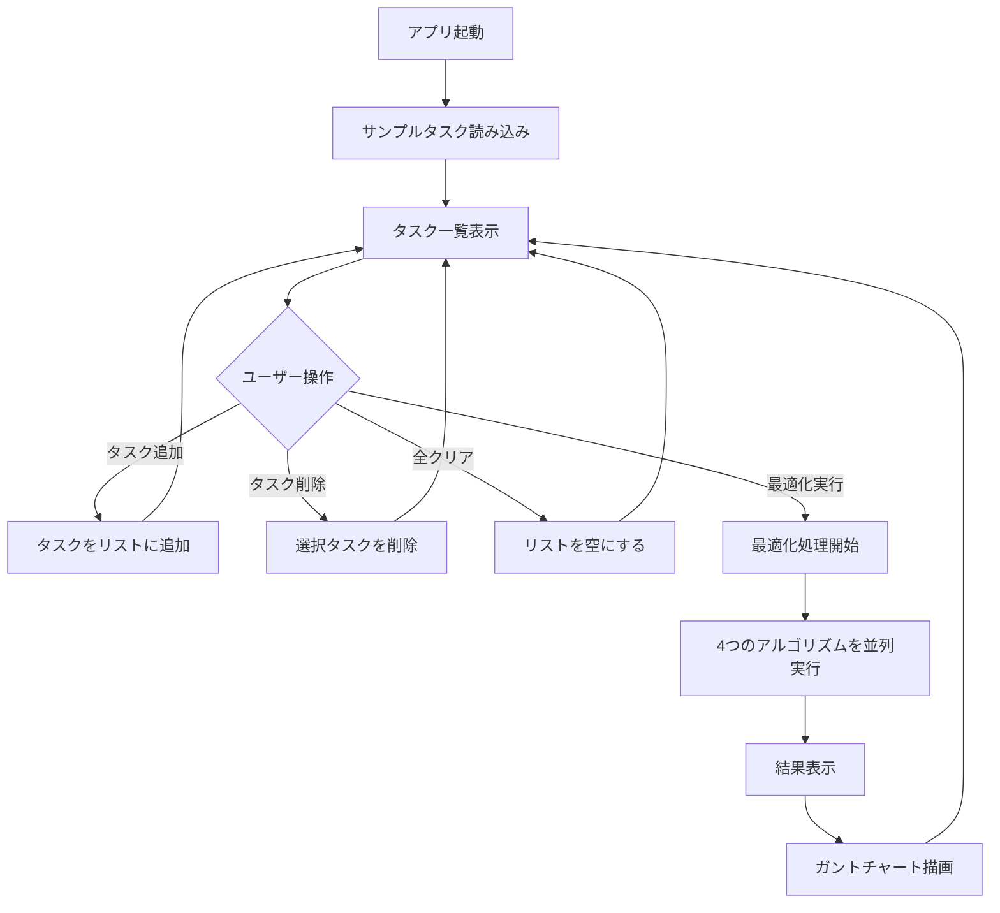
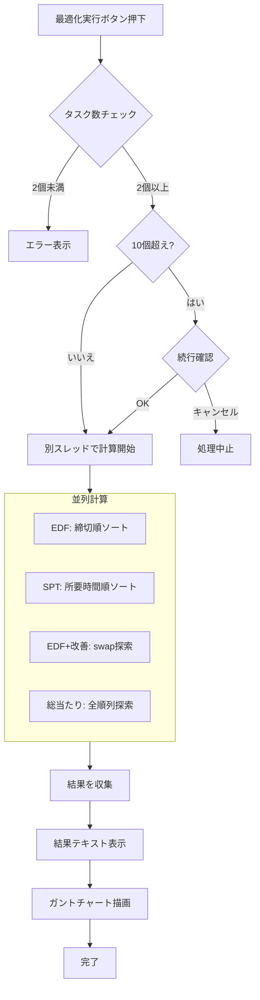
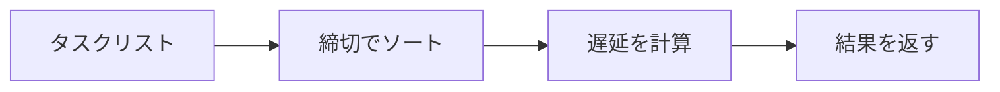
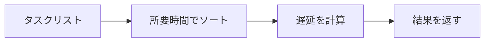
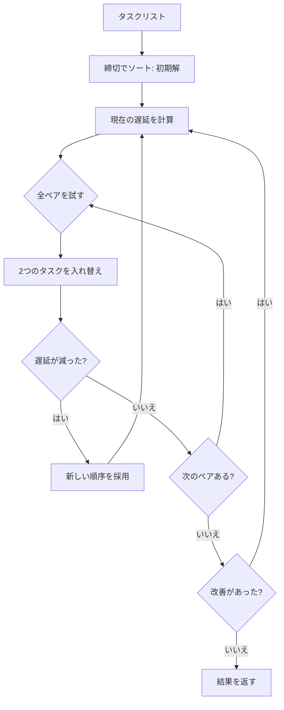
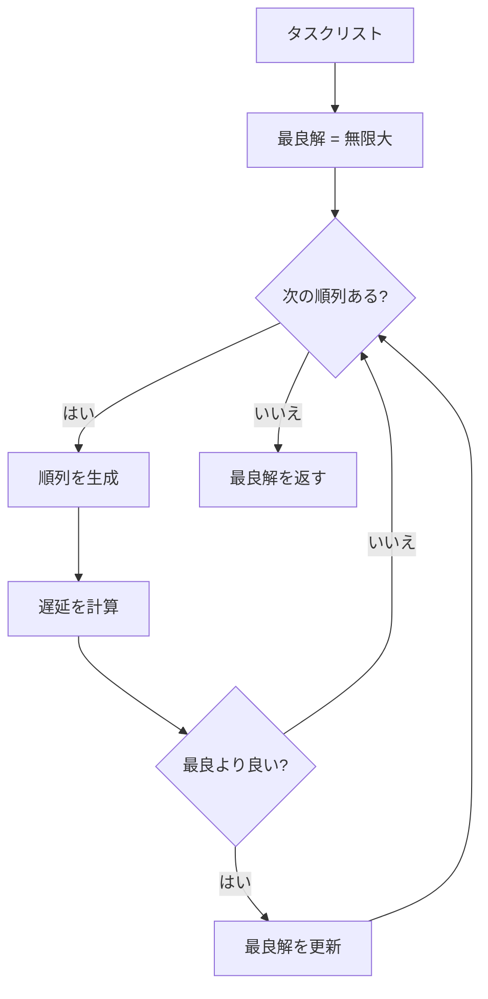
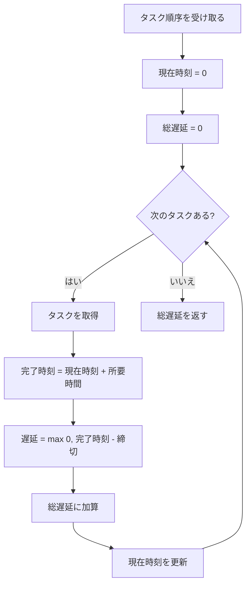
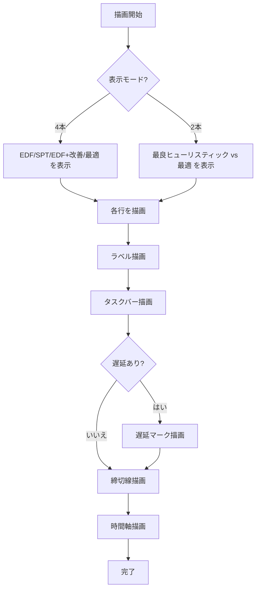
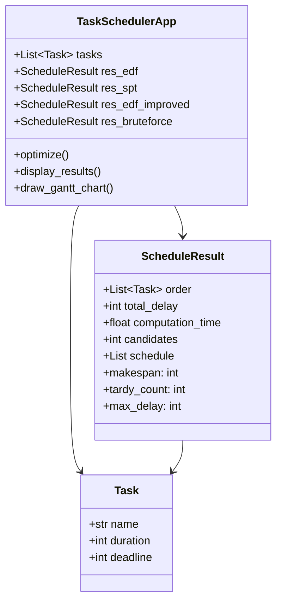

# 作業スケジューラ最適化 - 処理フロー

## 全体フロー

```mermaid
flowchart TD
    A[アプリ起動] --> B[サンプルタスク読み込み]
    B --> C[タスク一覧表示]

    C --> D{ユーザー操作}
    D -->|タスク追加| E[タスクをリストに追加]
    D -->|タスク削除| F[選択タスクを削除]
    D -->|全クリア| G[リストを空にする]
    D -->|最適化実行| H[最適化処理開始]

    E --> C
    F --> C
    G --> C

    H --> I[4つのアルゴリズムを並列実行]
    I --> J[結果表示]
    J --> K[ガントチャート描画]
    K --> C
```

## 最適化処理の詳細フロー

```mermaid
flowchart TD
    START[最適化実行ボタン押下] --> CHECK{タスク数チェック}
    CHECK -->|2個未満| ERROR[エラー表示]
    CHECK -->|2個以上| WARN{10個超え?}

    WARN -->|はい| CONFIRM{続行確認}
    WARN -->|いいえ| THREAD

    CONFIRM -->|キャンセル| END1[処理中止]
    CONFIRM -->|OK| THREAD

    THREAD[別スレッドで計算開始] --> PARALLEL

    subgraph PARALLEL[並列計算]
        EDF[EDF: 締切順ソート]
        SPT[SPT: 所要時間順ソート]
        IMP[EDF+改善: swap探索]
        BF[総当たり: 全順列探索]
    end

    PARALLEL --> COLLECT[結果を収集]
    COLLECT --> DISPLAY[結果テキスト表示]
    DISPLAY --> GANTT[ガントチャート描画]
    GANTT --> END2[完了]
```

## 各アルゴリズムの処理フロー

### EDF（締切が早い順）

```mermaid
flowchart LR
    A[タスクリスト] --> B[締切でソート]
    B --> C[遅延を計算]
    C --> D[結果を返す]
```

### SPT（所要時間が短い順）

```mermaid
flowchart LR
    A[タスクリスト] --> B[所要時間でソート]
    B --> C[遅延を計算]
    C --> D[結果を返す]
```

### EDF + ローカル探索

```mermaid
flowchart TD
    A[タスクリスト] --> B[締切でソート: 初期解]
    B --> C[現在の遅延を計算]

    C --> D{全ペアを試す}
    D --> E[2つのタスクを入れ替え]
    E --> F{遅延が減った?}

    F -->|はい| G[新しい順序を採用]
    G --> C

    F -->|いいえ| H{次のペアある?}
    H -->|はい| D
    H -->|いいえ| I{改善があった?}

    I -->|はい| C
    I -->|いいえ| J[結果を返す]
```

### 総当たり（全順列探索）

```mermaid
flowchart TD
    A[タスクリスト] --> B[最良解 = 無限大]
    B --> C{次の順列ある?}

    C -->|はい| D[順列を生成]
    D --> E[遅延を計算]
    E --> F{最良より良い?}

    F -->|はい| G[最良解を更新]
    F -->|いいえ| C
    G --> C

    C -->|いいえ| H[最良解を返す]
```

## 遅延計算のロジック

```mermaid
flowchart TD
    A[タスク順序を受け取る] --> B[現在時刻 = 0]
    B --> C[総遅延 = 0]

    C --> D{次のタスクある?}
    D -->|はい| E[タスクを取得]
    E --> F[完了時刻 = 現在時刻 + 所要時間]
    F --> G[遅延 = max 0, 完了時刻 - 締切]
    G --> H[総遅延に加算]
    H --> I[現在時刻を更新]
    I --> D

    D -->|いいえ| J[総遅延を返す]
```

## ガントチャート描画フロー

```mermaid
flowchart TD
    A[描画開始] --> B{表示モード?}

    B -->|4本| C[EDF/SPT/EDF+改善/最適 を表示]
    B -->|2本| D[最良ヒューリスティック vs 最適 を表示]

    C --> E[各行を描画]
    D --> E

    E --> F[ラベル描画]
    F --> G[タスクバー描画]
    G --> H{遅延あり?}
    H -->|はい| I[遅延マーク描画]
    H -->|いいえ| J
    I --> J[締切線描画]
    J --> K[時間軸描画]
    K --> L[完了]
```

## データ構造

```mermaid
classDiagram
    class Task {
        +str name
        +int duration
        +int deadline
    }

    class ScheduleResult {
        +List~Task~ order
        +int total_delay
        +float computation_time
        +int candidates
        +List schedule
        +makespan: int
        +tardy_count: int
        +max_delay: int
    }

    class TaskSchedulerApp {
        +List~Task~ tasks
        +ScheduleResult res_edf
        +ScheduleResult res_spt
        +ScheduleResult res_edf_improved
        +ScheduleResult res_bruteforce
        +optimize()
        +display_results()
        +draw_gantt_chart()
    }

    TaskSchedulerApp --> Task
    TaskSchedulerApp --> ScheduleResult
    ScheduleResult --> Task
```
