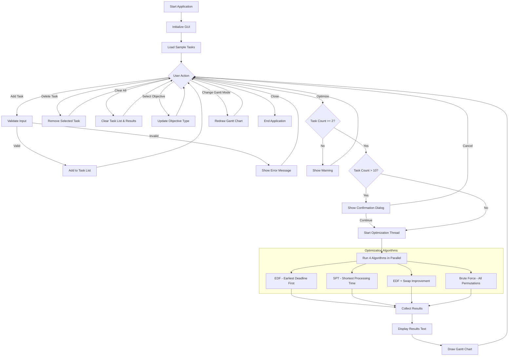
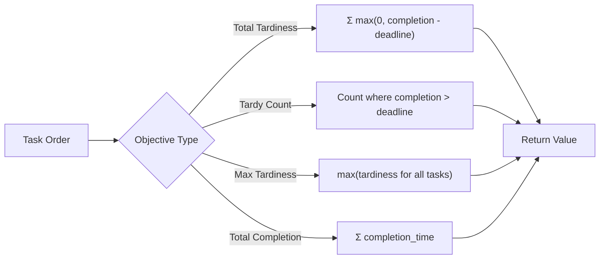
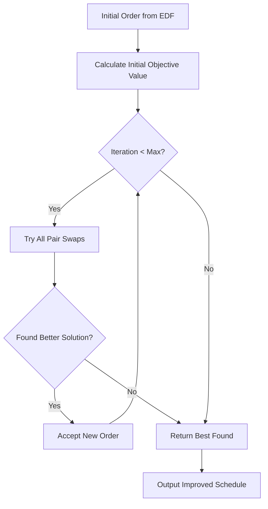
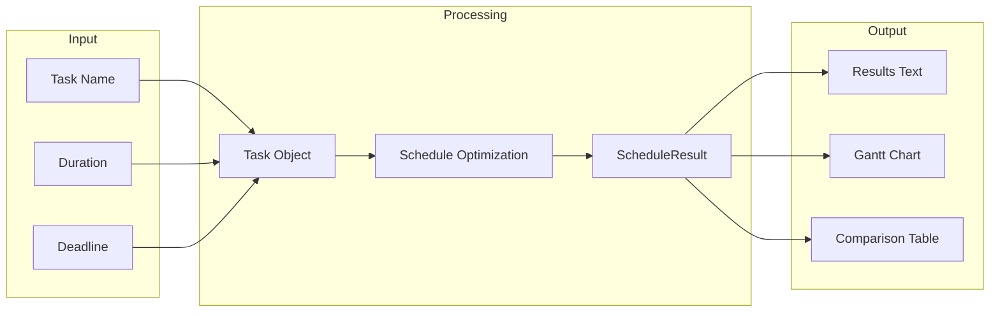

# Flowchart - Multi-Objective Task Scheduler

## Program Flow

```mermaid
flowchart TD
    A[Start Application] --> B[Initialize GUI]
    B --> C[Load Sample Tasks]
    C --> D{User Action}

    D -->|Add Task| E[Validate Input]
    E -->|Valid| F[Add to Task List]
    E -->|Invalid| G[Show Error Message]
    F --> D
    G --> D

    D -->|Delete Task| H[Remove Selected Task]
    H --> D

    D -->|Clear All| I[Clear Task List & Results]
    I --> D

    D -->|Select Objective| J[Update Objective Type]
    J --> D

    D -->|Optimize| K{Task Count >= 2?}
    K -->|No| L[Show Warning]
    L --> D
    K -->|Yes| M{Task Count > 10?}
    M -->|Yes| N[Show Confirmation Dialog]
    N -->|Cancel| D
    N -->|Continue| O[Start Optimization Thread]
    M -->|No| O

    O --> P[Run 4 Algorithms in Parallel]

    subgraph Optimization["Optimization Algorithms"]
        P --> Q1[EDF - Earliest Deadline First]
        P --> Q2[SPT - Shortest Processing Time]
        P --> Q3[EDF + Swap Improvement]
        P --> Q4[Brute Force - All Permutations]
    end

    Q1 --> R[Collect Results]
    Q2 --> R
    Q3 --> R
    Q4 --> R

    R --> S[Display Results Text]
    S --> T[Draw Gantt Chart]
    T --> D

    D -->|Change Gantt Mode| U[Redraw Gantt Chart]
    U --> D

    D -->|Close| V[End Application]
```

## Objective Function Calculation Flow

```mermaid
flowchart LR
    A[Task Order] --> B{Objective Type}

    B -->|Total Tardiness| C["Σ max(0, completion - deadline)"]
    B -->|Tardy Count| D["Count where completion > deadline"]
    B -->|Max Tardiness| E["max(tardiness for all tasks)"]
    B -->|Total Completion| F["Σ completion_time"]

    C --> G[Return Value]
    D --> G
    E --> G
    F --> G
```

## Local Search (Swap Improvement) Flow

```mermaid
flowchart TD
    A[Initial Order from EDF] --> B[Calculate Initial Objective Value]
    B --> C{Iteration < Max?}

    C -->|Yes| D[Try All Pair Swaps]
    D --> E{Found Better Solution?}
    E -->|Yes| F[Accept New Order]
    F --> C
    E -->|No| G[Return Best Found]

    C -->|No| G
    G --> H[Output Improved Schedule]
```

## Data Flow

```mermaid
flowchart LR
    subgraph Input
        A[Task Name]
        B[Duration]
        C[Deadline]
    end

    subgraph Processing
        D[Task Object]
        E[Schedule Optimization]
        F[ScheduleResult]
    end

    subgraph Output
        G[Results Text]
        H[Gantt Chart]
        I[Comparison Table]
    end

    A --> D
    B --> D
    C --> D
    D --> E
    E --> F
    F --> G
    F --> H
    F --> I
```
